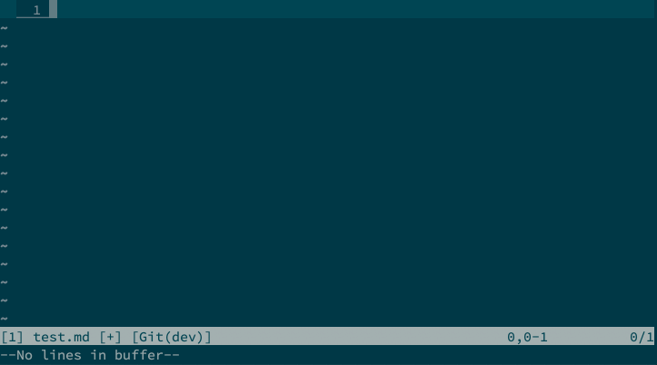

# vim-markdown-runner

Make your markdown interactive!



## Installation

Use your preferred package management tool, for vim-plugged:

```vim
Plug 'dbridges/vim-markdown-runner'
```

## Usage

Place your cursor inside a fenced code block and execute `:MarkdownRunner`. This will echo the results of executing the code block. `:MarkdownRunnerInsert` will insert the results in a new fenced code block directly below. If there is an existing code block below tagged with language `markdown-runner` it will be replaced with the new results.

You might consider mapping these for easy usage:
```vim
autocmd FileType markdown nnoremap <buffer> <Leader>r :MarkdownRunner<CR>
autocmd FileType markdown nnoremap <buffer> <Leader>R :MarkdownRunnerInsert<CR>
```

## Code Type Customization

`MarkdownRunner` passes the code contained in the block to the specified language runner through stdin. By default the runner command is the same as the specified language, so

~~~
```python
print("Hello World")
```
~~~

will run with `python`.

If no source language is specified it will use `$SHELL` as the run command.

You can overwrite or specify new commands by updating the `g:markdown_runners` dictionary. Set the value for a language to a string or a `Funcref` in your `.vimrc`:

```vim
" Specify an alternate shell command for a certain language
let g:markdown_runners['python'] = 'python3'

" Specify your own Vim script function for further customization.
" The function should receive a list of strings, representing the contents of
" the code block, and return a single string with the results.
function! MyHtmlRunner(src)
  " ... your custom processing
  return "Results"
endfunction

let g:markdown_runners['html'] = function('MyHtmlRunner')
```

You can set buffer specific runners with `b:markdown_runners`

## Builtin Runners

### Go

The Go runner will attempt to handle a variety of code blocks by (i) adding a default package declaration if one does not already exist, (ii) wrapping the entire code block in a `main` function, if `main` is not already defined, and (iii) running `goimports` on the final result. This lets you easily run code blocks without adding extra boilerplate, like this one in [`net/http`](https://golang.org/pkg/net/http/):

```go
resp, err := http.Get("http://example.com/")
if err != nil {
	// handle error
}
defer resp.Body.Close()
body, err := ioutil.ReadAll(resp.Body)
fmt.Println(string(body))
```

### Javascript

`js` and `javascript` code blocks will be run with `node`.

### Vimscript

Vimscript code blocks will be directly sourced.

## Additional Settings

`g:markdown_runner_populate_location_list` Set to `1` to always populate the location list with the results.
